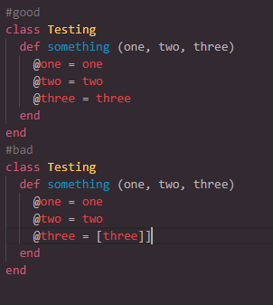

# Linter capstone project

> This is the readMe for the Linter Capstone Project. 

Good day world

Lets welcome one more code in the line of many more to come during our time here at Microverse. -Matija Maksimovic


Additional description about the project and its features.

## Built With

- Ruby
- RSpec

## Test
- in order to run test, you have to install rspec in your cmd run $gem install rspec
- run test by cd into spec file and use the command   ```rspec spec.rb```   


## Run Program

- To get a local copy up and running the linter follow these simple example steps:

- Clone this repository with git clone ```https://github.com/Mandeln/Linter-capstone.git``` using your terminal or command line.
- run the command ```cd bin``` to Change the directory 
- run the command ```ruby main`` and enjoy the parser

# Implemented Checks
1. check for wrong indentation
2. check for trailing spaces
3. check for missing/unexpected tags i.e. '( )', '[ ]', and '{ }'
4. check missing/unexpected end
5. check empty line error

# Check examples

- INDENTATION


- TRAILING SPACES


- TAG ERROR


- EMPTY LINE ERROR


- MISSING/UNEXPECTED END


## Authors

👤 **Author1**

- GitHub: [@MandeIn](https://github.com/MandeIn)
- Twitter: [@MandeIn](https://twitter.com/MandeIn)
- LinkedIn: [MandeIn](https://linkedin.com/MandeIn)

## 🤝 Contributing

Contributions, issues, and feature requests are welcome!

## Show your support

Give a ⭐️ if you like this project!

## Acknowledgments

- StackOverflow

## 📝 License

This project is [MIT](https://opensource.org/licenses/MIT) licensed.